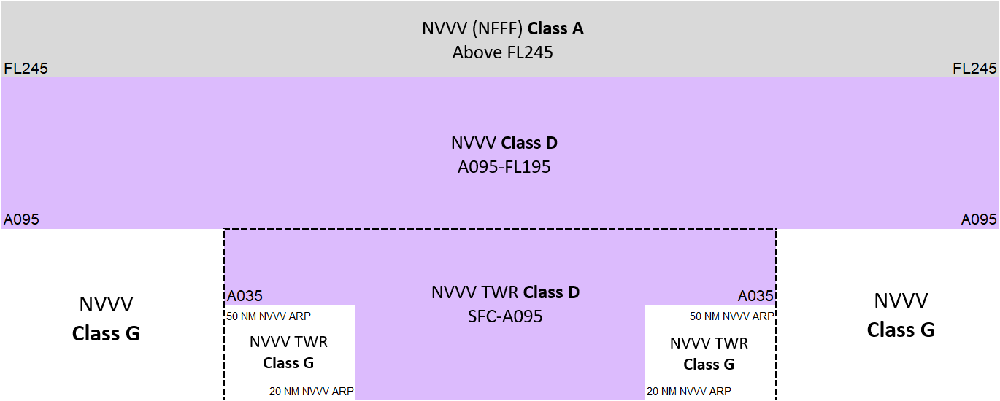

--8<-- "includes/abbreviations.md"

## Airspace

<figure markdown>
{ width="700" }
  <figcaption>Port Vila Sector Airspace Structure</figcaption>
</figure>

## Altimetry

### Transition Altitude 

Within the Port Vila sector, the transition altitude is 11,000 ft.

### Transition Level

| QNH (hPa)               | Transition Level |
| -------------------| ---------------- | 
| 980 Or Less | FL 140 | 
| Greater than 980| FL 130 | 

!!! note
    Charts can be found on the {target=new}, available under Documentation > Aeronautical Information Publication.